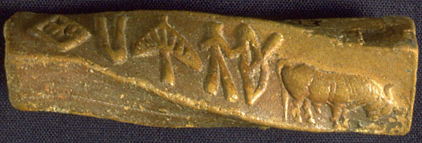

## Studies in the Indus civilization

This is an annotated repository of my studies on several aspects of the Indus civilization, the largest of the Bronze age urban civilizations and the earliest such civilization in the Indian continent. 

These studies were conducted with, borrowing a phrase from the pioneering historian [D. D. Kosambi](https://en.wikipedia.org/wiki/Damodar_Dharmananda_Kosambi), "combined methods", that is, by drawing 
tools and perspectives from several disciplines. In the course of these studies, I have had the privilege of collaborating with epigraphists, linguists, computer scientists, archaeologists, and geologists. Our work can be broadly divided into three categories:

* Positional and statistical studies of the Indus script
* Spatial and temporal studies of the growth and decline of Indus urbanism
* Machine learning of Indus seal characters

I describe each of these in greater detail below.

### Positional and statistical studies of the Indus script

* [Entropic Evidence for Linguistic Structure in the Indus Script](http://science.sciencemag.org/content/324/5931/1165), *Science*, **324**, 1165 (2009). [pdf](papers/EntropicEvidenceIndusScript.pdf)
* [A Markov model of the Indus script](http://www.pnas.org/content/106/33/13685.full), *PNAS*, **106**, 13685 (2009). [pdf](papers/MarkovModelIndusScript.pdf)
* [Statistical analysis of the Indus script using n-grams](), *Plos One*, **5**, e9506 (2010). [pdf](papers/StatisticalAnalysisIndusScriptNGram.pdf)
* [Entropy, the Indus script, and language](http://www.mitpressjournals.org/doi/10.1162/coli_c_00030), *Computational Linguistics*, **36**, 795 (2010). [pdf](papers/EntropyIndusScriptLanguage.pdf)

### Spatial and temporal studies of Indus urbanism

* [Spatio-temporal analyis of the Indus urbanization](http://www.jstor.org/stable/24109857?seq=1#page_scan_tab_contents), *Current Science*, **98**, 846 (2010).[pdf](papers/SpatioTemporalIndusUrbanisation.pdf)
* [Fluvial landscapes of the Harappan civilization](http://www.pnas.org/content/109/26/E1688.full.pd), *PNAS*, **109**, E1688 (2012). [pdf](papers/FluvialLandscapesHarappanCivilization.pdf)

### Machine learning of Indus seal characters

* [Deep learning the Indus script](https://arxiv.org/abs/1702.00523) - arxiv 1702.00523, submitted to *Plos One*. [pdf](https://arxiv.org/pdf/1702.00523)

